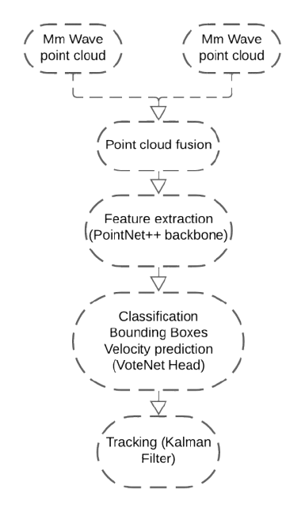

# See-Through

  

**Internship Project @ Actia Engineering Services**  

Advanced Driver Assistance System (ADAS) leveraging **mmWave radar fusion** for object detection, tracking, and scene understanding.
---

## Problem

Single radar-based systems in autonomous vehicles have a **narrow field of view**, limiting situational awareness.

---

## Solution

**Fusion of multiple radars** to enhance the field of view and provide a safer driving experience.

In this project, I work with **point cloud data from mmWave radars** to detect and track various objects on the road. By applying fusion techniques, I aim to improve environment understanding and significantly widen the radar coverage.

---

## Why mmWave Radars?

- Excellent at measuring **velocity** and **angle** of objects.
- Robust performance in adverse weather conditions such as **fog, rain, and dust**.
- Provide reliable data for **object detection and tracking**.

---

## Dataset

For this internship project, I chose to work with the **RadarScenes Dataset** because it contains **2D point clouds with velocity and RCS information** and is already labeled.

You can find and download the dataset here:  
[https://zenodo.org/records/4559821](https://zenodo.org/records/4559821)

---

## Proposed Workflow & Models

Below is the proposed workflow and the models I plan to explore, based on reviewing multiple research papers and comparing results:

---

# Usage

## 1. Clone this repo
## 2. Download the RadarScenes Dataset from the link provided.
## 3. Data preparation
Run the following files in order:
GroupOdometryIndex.py -> DataPreparation.py -> DataAugmentation.py -> MixData.py  
GroupOdometryIndex : To Group the the radar records by odmetting index  
DataPreparation: To delete the static data, filter by velocity and normlize the data  
DataAugmentation: To handle class imbalance  
MixData: To mix the generated data with the real existing data  
## 4. Early fusion
Run the following file for the radars early fusion technique: early_fusion.py  
## 5. Feature extraction
Run the followin files: train_pointnetpp.py -> precompute_features.py  
train_pointnetpp: To train the PointNet++ backbone model and save it.  
precompute_features: to extract the features using the traned model.  
## 6. Classification and velocity prediction
Run the followin file to train the votenet head: train_votenet_head. py  
## 7. Full pipeline
Run pipeline.py for the full pipeline execution.  